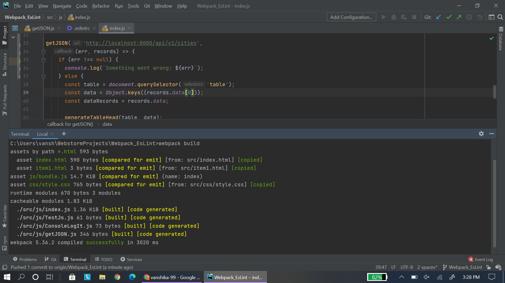

Screenshot of Webpack Build successfully compiling with no errors:

This is based on this tutorial:

Babel: https://www.robinwieruch.de/webpack-eslint/
What is ESLint?: https://medium.com/the-node-js-collection/why-and-how-to-use-eslint-in-your-project-742d0bc61ed7

Commands:
webpack build <- runs eslint on front end and babel npm run eslint <-runs eslint on the backend in the server directory
you will get an error if there are any eslint violations but that won't stop your program from running.

Prerequisites:
Install Node:
https://nodejs.org/en/download/
Complete the Babel Branch Tutorial

Install Webpack Globally by running this command on your terminal / command prompt

npm install --global webpack

Webpack Documentation: https://webpack.js.org/

To Use:

1. Clone the Repo
2. Run npm install
3. Run webpack serve to live reload your project, so you can see changes without refreshing the browser
4. Once it's running you can go to the dev server and see your changes: http://localhost:9000/
5. **run "webpack build" to bundle your code and put it in the docs folder so github pages can serve it**

Press Control C to stop the server or the builder

Turn on github pages and put a link to your site in the readme when you turn in the github repo link.

Working site here:

http://www.webizly.com/BasicWebPack/

Based on this tutorial:

https://medium.com/@rahulguptalive/create-crud-apis-in-nodejs-express-and-mysql-abda4dfc2d6